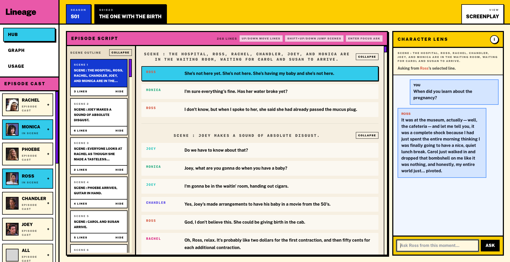
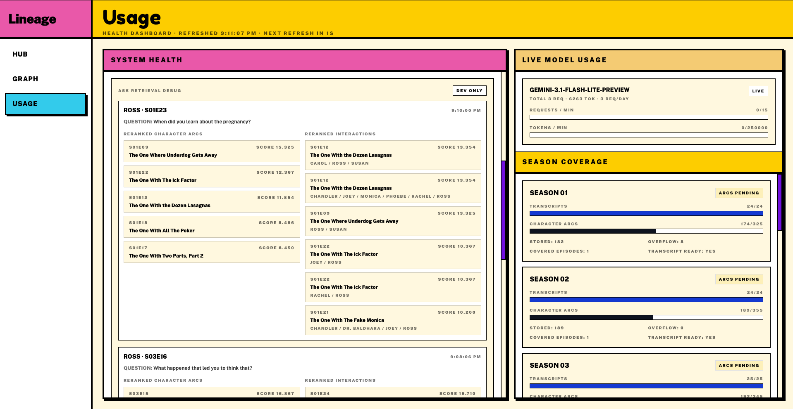
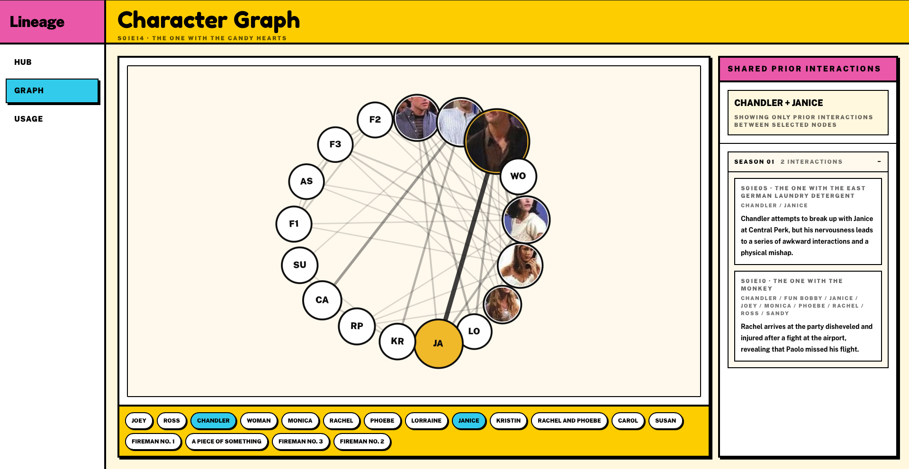

# Lineage

Lineage is a screenplay intelligence workspace for exploring a TV script as a living document instead of a flat transcript. It lets a user read an episode in screenplay form, click any dialogue line, and ask a character a question from that exact moment in time. It also shows prior character arcs and relationship context so answers stay grounded in what a character would realistically know.

**Home Page:**  


**Rerank Debugger:**  


**Prior Relationship Arc Summariser:**  


## What it is

Lineage sits somewhere between a script reader, a canon-memory system, and a character-aware chat interface.

The current product has three main surfaces:

- **Hub**: a screenplay-style viewer for the episode transcript
- **Graph**: a character relationship view with prior arcs and interactions
- **Usage**: a lightweight health dashboard for memory, models, and data coverage

Instead of replaying a transcript like a chat log, Lineage treats the script as a document with addressable moments. That makes it much easier to reason about continuity, character knowledge, and context.

## Why it exists

Most LLM-based story tools are good at generating text, but weak at respecting continuity. Characters often answer questions they should not know the answer to yet, and story memory becomes vague or generic very quickly.

Lineage was built to solve that problem. The goal is to make character interaction feel constrained by **time, perspective, and prior experience**, not by generic chatbot behavior.

That makes it useful for:

- writers and story editors
- people studying character continuity
- fans exploring a long-running show in a structured way
- anyone interested in grounded narrative AI rather than free-form roleplay

## Who it is for

The best fit today is:

- **writers’ room / story analysis use cases**
- **continuity and canon exploration**
- **AI product demos for narrative interfaces**

It is also a strong portfolio project for roles in:

- data science
- machine learning
- applied AI / LLM products
- retrieval systems
- intelligent UX / human-AI interaction

## What makes it different

Lineage is not just “chat with a character.”

It combines:

- **structured parsing** of screenplay-like transcripts
- **time-aware retrieval** so a character only answers from the correct point in the story
- **character-specific memory** and **interaction memory**
- **chunk reranking** so retrieved memory is re-scored against the current question and nearby scene context before generation
- **reference-aware recollection** so memory-style questions can show which prior episode chunks informed the answer
- **document-first UI** rather than a pure chatbot shell

The result is closer to a narrative reasoning interface than a general chat app.

## Competitors / adjacent products

There is not a perfect 1:1 competitor, but adjacent products include:

- **Sudowrite** and other AI writing assistants
- **Notion AI / general LLM workspaces**
- **screenwriting software** like Final Draft or WriterDuet
- **lore / canon databases** used by fandoms or narrative teams

What Lineage does differently is combine script reading, retrieval, character perspective, and narrative memory in one interface.

## How it works

At a high level:

1. episode transcripts are parsed into structured scenes and dialogue
2. prior character arcs and interaction summaries are generated with an LLM
3. those memories are stored for retrieval
4. the UI lets a user inspect a script, choose a moment, and query a character from that exact context

The project supports two deployment modes:

- **Local / LAN mode**: uses a live Chroma-backed memory store
- **Vercel mode**: uses exported read-only JSON memory so the app remains serverless-friendly

That means the same repo works both as a richer local development environment and as a deployable GitHub + Vercel showcase.

## CS + AI concepts demonstrated

This project is a good showcase because it applies several practical concepts together:

- **Retrieval-Augmented Generation (RAG)** for character memory
- **retrieval reranking** for higher-relevance memory selection
- **context-window control** so answers stay bounded to the selected script moment
- **entity-centric memory modeling** for characters and interactions
- **data parsing / preprocessing** from semi-structured HTML transcripts
- **graph-style reasoning UI** for relationships and prior interactions
- **rate-limited LLM orchestration** across multiple models
- **state management** across frontend, backend, and per-device sessions
- **dual deployment architecture** for local persistence vs. serverless hosting

In other words, this is not only a frontend demo. It is also a data pipeline, retrieval system, and applied AI interface.

In development mode, the Usage page can also show the latest Ask rerank traces, which makes it easier to inspect why particular memory chunks were selected.

## Running locally

From the repo root:

```bash
./scripts/friendsos.sh start local dev
```

Then open:

```text
http://127.0.0.1:5173
```

To stop it:

```bash
./scripts/friendsos.sh stop local dev
```

## Vercel deployment

The repo is set up to deploy from GitHub to Vercel.

- frontend is built from `frontend/`
- the FastAPI backend is exposed through `api/`
- Vercel uses the bundled read-only memory in `memory_data/`

If you regenerate character arcs locally and want Vercel to use the latest memory snapshot, run:

```bash
./.venv311/bin/python scripts/export_memory_store.py
```

For detailed deployment notes, see [VERCEL_DEPLOY.md](./VERCEL_DEPLOY.md).

## Project summary

Lineage is a narrative AI product built around a simple idea: a character should only answer from what they have actually lived through. The project turns that idea into a usable interface with transcript parsing, memory generation, retrieval, graph exploration, and a deployable app surface.

It is both a product prototype and a portfolio-quality applied AI system.
